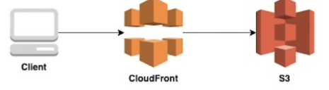

# 티켓 예매 프로젝트 (AWS Serverless Project)

[Notion Docs](https://www.notion.so/Serverless-d28b19c7b3404579b5fc58a28ed8aee5)  

[사이트 바로가기](https://d32irlhdxs9v1a.cloudfront.net/)

- AWS의 각 서비스가 어떤 역활, 설정, 운영 되는지 배우고 프로젝트를 통해서 직접 구축, 배포 했습니다.
- BLACKPINK 티켓 예매 프로젝트, 간단한 UI를 구성하고 Severless구축에 집중 하였습니다.

## 💡 Specs

- HTML, CSS, JS
- Ajax
- Material Design Lite
- Python
- S3
- CloudFront
- Lambda, boto3, qrcode, PIL
- SNS
- API Gateway
- DynamoDB
- Doker, Docker Compose

# AWS Serverless 아키텍쳐

  

# <자세한 기능 설명>

### 1. 메인 화면 - 개인정보 입력 양식

 

- 메인 UI에서는 원하는 개인정보를 등록해서 티켓을 등록 할 수 있습니다.

### 1. 메인 화면 - AWS 구현

 

- API Gateway를 통해서 Lambda함수를 실행 후 DynamoDB에 Form데이터 넣고 SNS에
  새로운 데이터가 들어 왔다는 것을 알려줌과 동시에 UserID를 같이 넘겨준다.

### 2. 등록 리스트

 

- 티켓 등록이 완료된 리스트를 보여줍니다.

### 2. 등록 리스트 - AWS 구현

 

- API Gateway를 통해서 Lambda함수를 실행 후 DynamoDB에 앞서 저장한 Form 데이터를 가져 옵니다.

### 3. Ticket 다운로드

 

- 프린트 모양의 버튼을 클릭하면 이름, 소속이 적힌 개인 Ticket이 나오면서 PRINT를 누르면 PDF로 Ticket을 다운로드 할 수 있습니다.

### 3. Ticket 다운로드 - AWS Ticket, QRcode 만들기 구현

 

- 앞서 설정한 SNS에서 데이터가 추가 됬으면 자동으로 Make Image Lambda함수가 실행되고 Ticket, QRcode를 만드는 로직
- SNS에서 넣어준 UserID를 통해서 DynamoDB에 해당 UserID와 맞는 데이터를 가져와서
  Ticket, QRcode를 만들고 S3에 저장.

# <배포>

### 1. 메인 화면 - 개인정보 입력 양식

 

- S3에 Static Web Hosting을 이용해서 Frontend 앱을 배포
- S3의 Ojbect에 집접 요청을 하면 그만큼 비용이 많이 발생 할 수 있어서 CloudFront로
  접속하게 해서 비용을 줄일 수 있다.
